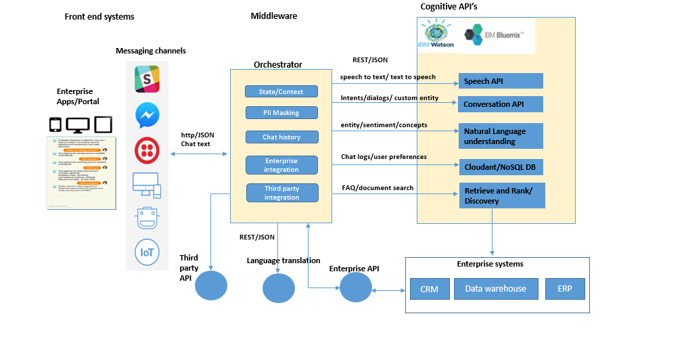
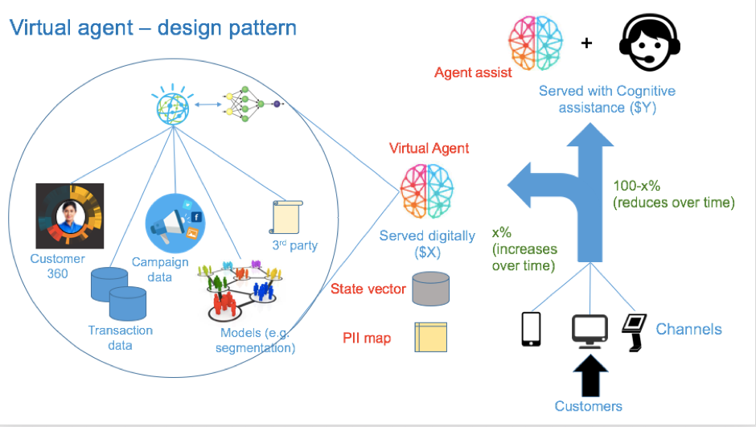
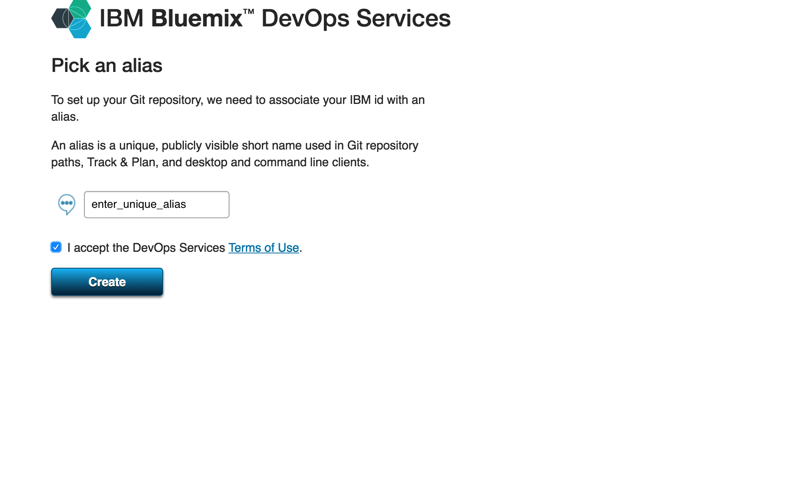
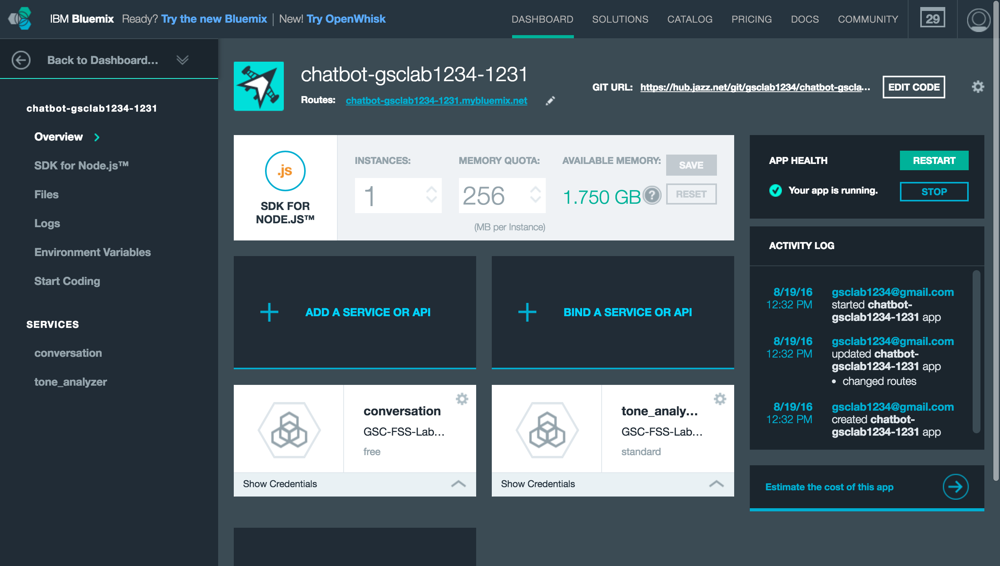

# Multi - Domain Call Center Digital Assistant

In this developer journey we will create a Watson Conversation, NLU & RnR based chatbot for multiple domains. that provides call center agents with: 
Answers important FAQs queries from the multiple domains such as various business lines of Telecom.  

When the reader has completed this journey, they will understand how to:

* Create a chatbot with dialogs using Watson Conversation on NodeJS platform.
* Learn how to best create Retrieve n Rank collection for long tail questions.
* Understand the Telecom domain for creating a chatbot & using Conversation and Retrieve n Rank in sync.

Suppose the customer is not satisfied with the answer provided by the customer chatbot and would want to talk to the call center agent, then the customer would call the call center.

The customer facing chatbot would store the chat transcript to a Cloudant NoSql DB against the unique customer phone number.
The call center agent chatbot would read the chat transcript based on the customer phone number and retrieve the intent.

Based on the intent which is retrieved then a RnR service is triggered and on load of the call center chat bot the predictive solutions would be displayed to the call center agent.

This enables the call center agent to: 

1) provide consistent solutions to customer problems.
2) faster solutions to the customer.

When the reader has completed this journey, they will understand how to:

* Create a chatbot dialog with Watson Conversation
* Dynamically store and update a Cloudant NoSQL database based on chatbot results

## Technical Architecture - CallCenterAgent Digital Assistant
<b>
&nbsp;&nbsp;&nbsp;&nbsp;&nbsp;&nbsp;&nbsp;&nbsp;&nbsp;&nbsp;&nbsp;&nbsp;&nbsp;&nbsp;&nbsp;&nbsp;&nbsp;&nbsp;&nbsp;&nbsp;&nbsp;&nbsp;&nbsp;&nbsp;&nbsp;&nbsp;&nbsp;&nbsp;&nbsp;&nbsp;&nbsp;&nbsp;&nbsp;&nbsp;&nbsp;&nbsp;&nbsp;&nbsp;&nbsp;&nbsp;&nbsp;&nbsp;&nbsp;&nbsp;&nbsp;&nbsp;&nbsp;&nbsp;&nbsp;&nbsp;&nbsp;&nbsp;&nbsp;&nbsp;&nbsp;
&nbsp;&nbsp;&nbsp;&nbsp;&nbsp;&nbsp;&nbsp;&nbsp;&nbsp;&nbsp;&nbsp;&nbsp; 
&nbsp;&nbsp;&nbsp;&nbsp;&nbsp;&nbsp;&nbsp;&nbsp;&nbsp;&nbsp;&nbsp;&nbsp;

&nbsp;&nbsp;&nbsp;&nbsp;&nbsp;&nbsp;&nbsp;&nbsp;&nbsp;&nbsp;&nbsp;&nbsp;&nbsp;&nbsp;&nbsp;&nbsp;&nbsp;&nbsp;&nbsp;&nbsp;&nbsp;&nbsp;&nbsp;&nbsp;&nbsp;&nbsp;&nbsp;&nbsp;&nbsp;&nbsp;&nbsp;&nbsp;&nbsp;&nbsp;&nbsp;&nbsp;&nbsp;&nbsp;&nbsp;&nbsp;&nbsp;&nbsp;&nbsp;&nbsp;&nbsp;&nbsp;&nbsp;&nbsp;&nbsp;&nbsp;&nbsp;&nbsp;&nbsp;&nbsp;&nbsp;
&nbsp;&nbsp;&nbsp;&nbsp;&nbsp;&nbsp;&nbsp;&nbsp;&nbsp;&nbsp;&nbsp;&nbsp; 
&nbsp;&nbsp;&nbsp;&nbsp;&nbsp;&nbsp;&nbsp;&nbsp;&nbsp;&nbsp;&nbsp;&nbsp;

- The user writes a query about a service to the chatbot
- The orchestrator accepts query, saves the user context & starts a REST call with the Cognitive APIs.
- Depending on the nature of the query (long /Short tail), the answer is provided by either Watson Conversation API or Watson Retrieve and Rank

## Included Components
- Bluemix Watson Conversation
- Bluemix Watson Retrieve n Rank
- Node JS Runtime
- Bluemix Cloudant NoSQL DB

## Deploy the App
a. Click on the 'Deploy to Bluemix' button below.

&nbsp;&nbsp;&nbsp;&nbsp;&nbsp;&nbsp;&nbsp;&nbsp;&nbsp;&nbsp;&nbsp;&nbsp; 

<i>Note: If you do not want to know the deploy steps below. Jump to after step 'f'.</i>

b. Log in with your Bluemix account.

&nbsp;&nbsp;&nbsp;&nbsp;&nbsp;&nbsp;&nbsp;&nbsp;&nbsp;&nbsp;&nbsp;&nbsp; 

c. If you are asked to choose an alias, then follow these instructions. Otherwise, proceed to [step 4](#4_view) in this section.

c.1 Enter a unique alias name and click create.
&nbsp;&nbsp;&nbsp;&nbsp;&nbsp;&nbsp;&nbsp;&nbsp;&nbsp;&nbsp;&nbsp;&nbsp; 

c.2 Verify your alias name and click continue.
&nbsp;&nbsp;&nbsp;&nbsp;&nbsp;&nbsp;&nbsp;&nbsp;&nbsp;&nbsp;&nbsp;&nbsp; 

d. Name your app, and then select the Region, Organization and Space where the app will be deployed. Click 'DEPLOY'.

&nbsp;&nbsp;&nbsp;&nbsp;&nbsp;&nbsp;&nbsp;&nbsp;&nbsp;&nbsp;&nbsp;&nbsp; 

* The status of the deployment is shown. This can take approximately 2 minutes to complete.

&nbsp;&nbsp;&nbsp;&nbsp;&nbsp;&nbsp;&nbsp;&nbsp;&nbsp;&nbsp;&nbsp;&nbsp;

* The deployment process performs the following actions:
- Creates the application.
- Creates a Conversation and Cloudant NoSQL service instance.

e.  After the deployment has completed, click on the 'Deployed to Bluemix sucessfully' link.

&nbsp;&nbsp;&nbsp;&nbsp;&nbsp;&nbsp;&nbsp;&nbsp;&nbsp;&nbsp;&nbsp;&nbsp;

You will land on the Overview page of your application.
If you like to try out the App, go ahead and click on 'View Your App'.

&nbsp;&nbsp;&nbsp;&nbsp;&nbsp;&nbsp;&nbsp;&nbsp;&nbsp;&nbsp;&nbsp;&nbsp;

f. The application and services have been successfully deployed, and you are now ready to begin the lab!

1. [Clone the repo](#1-clone-the-repo)
2. [Create Watson services on IBM Bluemix](#2-create-watson-services-on-ibm-bluemix)
3. [Configure Watson Conversation](#3-configure-watson-conversation)
4. [Configure Watson Retrieve and Rank](#4-configure-watson-retrieve-and-rank)
5. [Run the application](#5-run-the-application)

## 1. Clone the repo

Clone the `call-center-agent` locally. In a terminal, run:

  `$ git clone https://github.com/ibm/call-center-agent`

We’ll be using the file [`WCS/calldrop.json`](dev-resources/WCS/calldrop.json)

## 2. Create Watson services on IBM Bluemix

Create the following services:

  * [**Watson Conversation**](https://console.ng.bluemix.net/catalog/services/conversation)
  * [**Watson RetrievenRank](https://console.ng.bluemix.net/catalog/services/retrieve-and-rank?taxonomyNavigation=services)
  * [**Cloudant NoSQL DB**](https://console.ng.bluemix.net/catalog/services/cloudant-nosql-db/)

## 3. Configure Watson Conversation

Launch the **Watson Conversation** tool. Use the **import** icon button on the right

  

Find the local version of [`dev-resources/WCS/calldrop.json`](dev-resources/WCS/calldrop.json) and select
**Import**. Find the **Workspace ID** by clicking on the context menu of the new
workspace and select **View details**. Save this ID for later.

  

*Optionally*, to view the conversation dialog select the workspace and choose the
**Dialog** tab, here's a snippet of the dialog:

## 4. Configure Watson Retrieve and Rank

Launch the **Watson retrieve-and-rank** tool. Create a **new data cluster**.

  

Seed the content by firstly creating **New Collection**, and add the file documents and questions present under [`dev-resources/RnR/`](dev-resources/RnR/)

  

  Note: Ensure that you have also created a [**Watson Document Conversion**](https://console.ng.bluemix.net/catalog/services/document-conversion) service as well. Since, Watson RnR uses document conversion at the backend.</i>
## 5. Run the application

### If you used the Deploy to Bluemix button...

If you used ``Deploy to Bluemix``, most of the setup is automatic to start using the App.

### If you want to run it locally...

Otherwise as explained above:
1. Clone the repo
2. Instantiate/ Configure the above watson services
2. Install NodeJS runtime or npm.
3. Start the app and it can be used at localhost:3000

Note: server host can be changed as required in server.js

# License

This sample code is licensed under Apache 2.0.
Full license text is available in [LICENSE](LICENSE).

# Contributing

You are most welcome to contribute to this project.
Please find the details about it in [CONTRIBUTING](CONTRIBUTING.md)

# Maintaining

Your are most welcome to help us in maintaining this project.
Please find the details about it in [MAINTAINING](MAINTAINERS.md)

## Open Source @ IBM

Find more open source projects on the
[IBM Github Page](http://ibm.github.io/).
